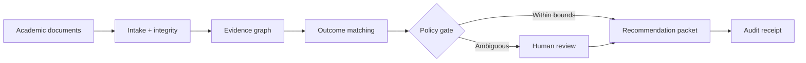

# CreditBridge AI

**Autonomous transfer-credit operations with human-controlled academic decisions.**

[Open the hosted synthetic demo](https://creditbridge-ai.wangshiyue1128.chatgpt.site)

CreditBridge receives transcripts, syllabi, and degree requirements; constructs a cited evidence graph; compares course outcomes; applies institutional policy; and assembles a decision-ready packet. It interrupts an advisor only when evidence is incomplete, contradictory, low-confidence, or requires academic judgment.

> CreditBridge recommends and prepares. Authorized institutional staff make every final credit decision.

## Why it matters

Transfer-credit evaluation is a high-volume, document-heavy workflow. Evidence arrives in inconsistent formats, equivalency decisions require source-level justification, and missing information creates repeated exchanges between students, advisors, departments, and registrars. CreditBridge converts that fragmented process into a bounded, observable workflow without pretending that an AI model has academic authority.

## Product workflow

1. **Intake Agent** validates files and normalizes course, unit, grade, and institution data.
2. **Evidence Agent** extracts learning outcomes with page-level source citations.
3. **Matching Agent** compares outcomes, rigor, assessment depth, contact hours, prerequisites, and laboratory work.
4. **Policy Agent** applies explicit institutional thresholds and stops on material ambiguity.
5. **Packet Agent** assembles the recommendation, missing-evidence request, and permanent review packet.
6. **Human decision gate** requires an authorized advisor or faculty reviewer for the final determination.



## What is working in v0.2

- Advisor operations dashboard with queue, case workspace, evidence comparison, decision gate, and provenance ledger.
- Server-side deterministic evidence-analysis API with bounded request contracts.
- Synthetic text-source upload, outcome analysis, policy routing, and exportable JSON evidence packets.
- Five-stage runnable workflow with explicit pause-before-decision behavior.
- Outcome-level matching with cited source findings and confidence indicators.
- Advisor approval, conditional approval, and faculty escalation interactions.
- SHA-256 document integrity and tamper-evident human-decision receipts.
- Deterministic policy kernel with validation and tests for high-confidence, weak, incomplete, malformed, and non-synthetic cases.
- Strands Agents SDK orchestration plus an AgentCore-compatible container entrypoint.
- GitHub Actions checks for the web build, API workflow, policy tests, linting, and Python compilation.
- Responsive desktop and mobile layout.

The hosted interface uses a synthetic, de-identified demonstration case and a real server endpoint, but it does **not** call Amazon Bedrock. It does not claim a live university integration, production document extraction, or an official academic determination.

## Architecture

| Layer | Responsibility | Initial implementation |
|---|---|---|
| Experience | Advisor queue, evidence inspection, decisions | Next.js, React, TypeScript |
| Orchestration | Fixed, observable agent sequence | Strands Agents SDK, AgentCore entrypoint |
| Decision kernel | Deterministic thresholds and escalation | Pure Python domain module |
| Evidence | Source citations and document integrity | Structured outcomes, SHA-256 receipts |
| Governance | Human authority and policy boundaries | Mandatory decision gate |
| Observability | Event provenance and mutation detection | Hash-chained audit receipts |

The architecture deliberately separates probabilistic extraction and matching from deterministic authorization. Model output can propose evidence and candidates; policy code determines whether the case must stop, and a human owns the consequential decision.

## Local setup

### Interface

```bash
npm ci
npm run dev
```

Run the complete web acceptance suite:

```bash
npm test
```

### Agent runtime

Python 3.12+ is recommended. Policy and deterministic runtime tests do not need AWS credentials.

```bash
python -m venv .venv
source .venv/bin/activate
pip install -r requirements.txt
python -m unittest -v tests/test_policy.py
```

Live Strands inference is opt-in. It requires AWS credentials, access to an approved Amazon Bedrock model, and all of these explicit settings:

```text
CREDITBRIDGE_EXECUTION_MODE=strands
CREDITBRIDGE_ALLOW_LIVE_MODEL=true
BEDROCK_MODEL_ID=<approved model ID>
```

The default is deterministic, model-free execution. See the [AgentCore deployment runbook](docs/aws-agentcore-deployment.md).

## Request contract

The hosted demonstration accepts only synthetic text evidence. The AgentCore runtime additionally requires `synthetic: true`; a request without that assertion is rejected. Example:

```json
{
  "synthetic": true,
  "case_id": "CB-DEMO-0001",
  "source_course": "DEMO CS 38",
  "target_course": "DEMO CS 33",
  "source_text": "Object-oriented design and data structures"
}
```

Every response leaves `final_credit_decision` unset. A model or policy score may prepare a recommendation, but only an authorized institution can award or deny transfer credit.

## Security and privacy boundaries

- No silent award, denial, or modification of academic credit.
- No inference of missing grades, units, institutions, or course identities.
- Every material claim must carry a source citation.
- Low-confidence, conflicting, or incomplete evidence routes to a human.
- Demonstration records are synthetic and contain no student education records.
- The public demo rejects requests that are not explicitly marked synthetic and limits source text to 50,000 characters.
- Live Bedrock execution is disabled by default to prevent accidental cost or data transfer.
- Production deployment requires institution-controlled identity, retention, encryption, and FERPA review.

## Evaluation plan

- Field extraction accuracy.
- Outcome-to-source citation precision.
- Equivalency candidate recall at `k`.
- False auto-clear rate, which must remain zero for policy-gated cases.
- Correct escalation rate.
- Median advisor handling time.
- Reproducibility of generated packets and audit receipts.

## Deliberate non-claims

- No production OCR or PDF parser is wired into the hosted demo yet; its upload control reads `.txt`, `.md`, `.csv`, and `.json` source text.
- No SIS, registrar, ASSIST, or university catalog integration is active.
- No FERPA compliance certification is claimed.
- No case can be finalized autonomously.

## Repository policy

CreditBridge AI was created during the 2026 Agents for Humans submission period. It uses open-source frameworks and standard development tooling. It is a new codebase and does not copy code from Continuum, Continuum Sentinel, or earlier projects.

Released under the [MIT License](LICENSE).
