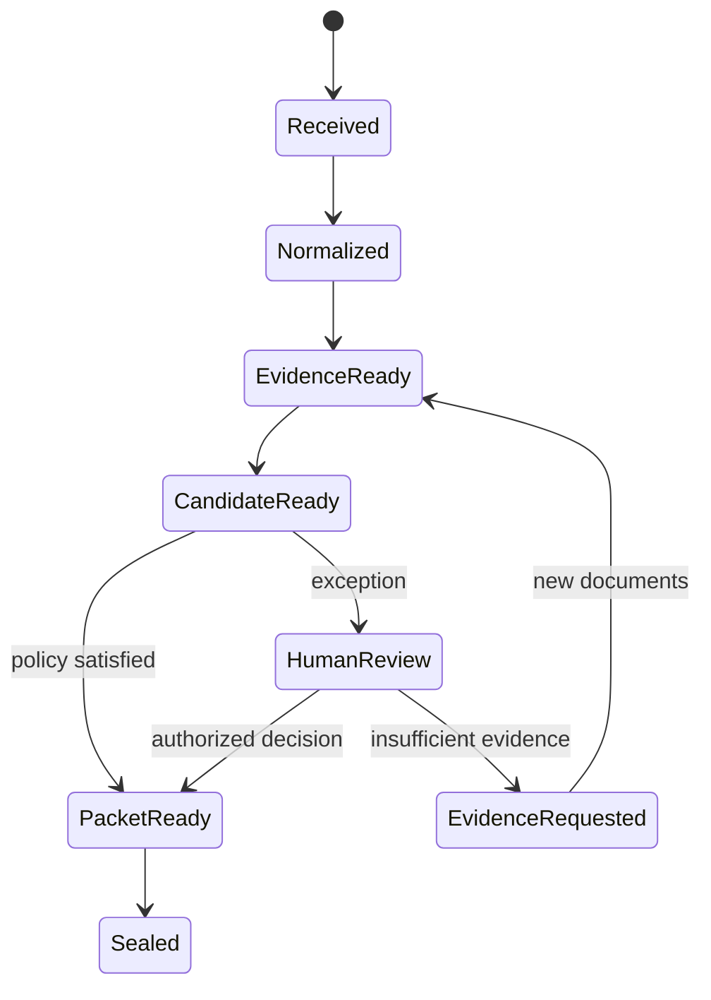

# Architecture Decision Record 001 — Evidence before autonomy

## Status

Accepted for v0.1.

## Decision

CreditBridge uses a deterministic sequential workflow rather than an open-ended swarm. Transfer-credit cases have ordered dependencies, audit requirements, and irreversible institutional consequences. Every stage therefore has a typed responsibility, bounded tools, structured output expectations, and a recoverable checkpoint.

## Trust boundaries

| Boundary | Model may | Model may not |
|---|---|---|
| Intake | Extract explicitly present fields | Invent missing fields |
| Evidence | Locate and summarize cited outcomes | Treat an uncited claim as evidence |
| Matching | Rank possible equivalents | Declare an official equivalency |
| Policy | Explain which rule triggered | Bypass a deterministic rule |
| Packet | Assemble approved evidence | Change a score or source |
| Human gate | Request a bounded decision | Impersonate an advisor |

## State machine

## Failure handling

- A stage retries only transient tool failures; malformed or contradictory evidence does not retry into a different answer.
- The case resumes from the last completed stage without rerunning verified upstream work.
- Every tool input, output, policy version, and human action is appended to the receipt chain.
- A new document invalidates only downstream stages derived from that document.
- Finalization is idempotent and requires an authorized decision identifier.

## Production migration

The demo uses de-identified fixtures. Production requires institution-owned document storage, fine-grained identity and authorization, encryption at rest and in transit, configurable retention, access logging, model-data handling review, and integration through approved student-information-system APIs.
