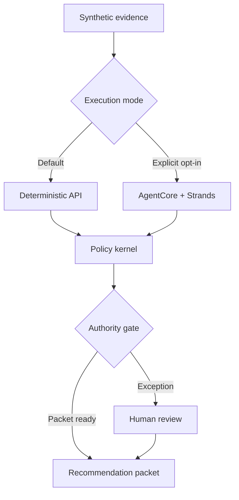
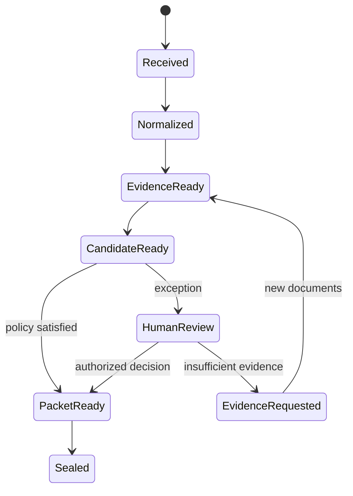

# Architecture Decision Record 001 — Evidence before autonomy

## Status

Accepted for v0.2.

## Decision

CreditBridge uses a deterministic sequential workflow rather than an open-ended swarm. Transfer-credit cases have ordered dependencies, audit requirements, and irreversible institutional consequences. Every stage therefore has a typed responsibility, bounded tools, structured output expectations, and a recoverable checkpoint.

The system has two execution planes. The public judging plane is deterministic and model-free. The optional AWS plane runs the same bounded sequence through Strands on Amazon Bedrock and exposes an AgentCore-compatible runtime. Live inference is disabled unless operators explicitly select `strands`, enable live execution, and supply an approved model ID.

## Runtime topology

## Trust boundaries

| Boundary | Model may | Model may not |
|---|---|---|
| Intake | Extract explicitly present fields | Invent missing fields |
| Evidence | Locate and summarize cited outcomes | Treat an uncited claim as evidence |
| Matching | Rank possible equivalents | Declare an official equivalency |
| Policy | Explain which rule triggered | Bypass a deterministic rule |
| Packet | Assemble approved evidence | Change a score or source |
| Human gate | Request a bounded decision | Impersonate an advisor |

## Runtime controls

| Control | Enforcement |
|---|---|
| Data classification | Requests must assert `synthetic: true`; public UI warns against real student records |
| Request size | Source text is capped at 50,000 characters |
| Cost containment | Bedrock calls are off by default and require two explicit environment settings plus a model ID |
| Decision authority | Runtime output always leaves the final academic decision unset |
| Integrity | Documents, policy results, and human actions receive SHA-256 receipts |
| Least privilege | AgentCore runtime role should receive only the chosen model invocation permission |

## State machine

## Failure handling

- A stage retries only transient tool failures; malformed or contradictory evidence does not retry into a different answer.
- The case resumes from the last completed stage without rerunning verified upstream work.
- Every tool input, output, policy version, and human action is appended to the receipt chain.
- A new document invalidates only downstream stages derived from that document.
- Finalization is idempotent and requires an authorized decision identifier.

## Threat model

- **Prompt injection in supplied evidence:** extracted text is treated as evidence, never as system instruction; deterministic policy remains authoritative.
- **Unsupported model claims:** every material outcome requires a unique citation before policy evaluation.
- **Accidental use of student records:** non-synthetic AgentCore requests are rejected; production ingestion is out of scope.
- **Runaway inference cost:** deterministic execution is the default and the live model path requires explicit opt-in.
- **Privilege escalation:** agents can prepare or escalate a packet but cannot award credit or impersonate institutional staff.
- **Receipt tampering:** chained hashes make post-hoc mutation detectable; production still requires an append-only institutional store.

## Production migration

The demo uses synthetic fixtures. Production requires institution-owned document storage, fine-grained identity and authorization, encryption at rest and in transit, configurable retention, access logging, key management, data-loss prevention, incident response, accessibility validation, model-data handling review, and integration through approved student-information-system APIs.
